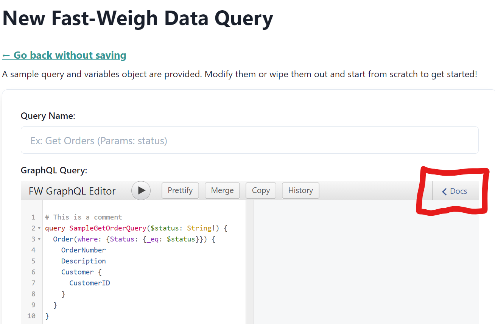
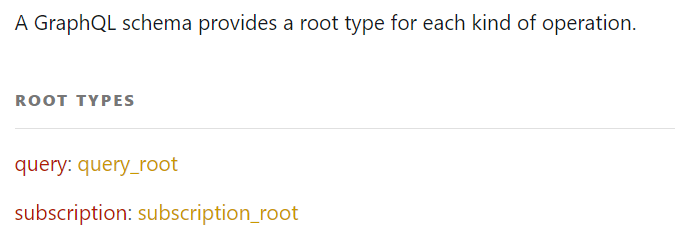
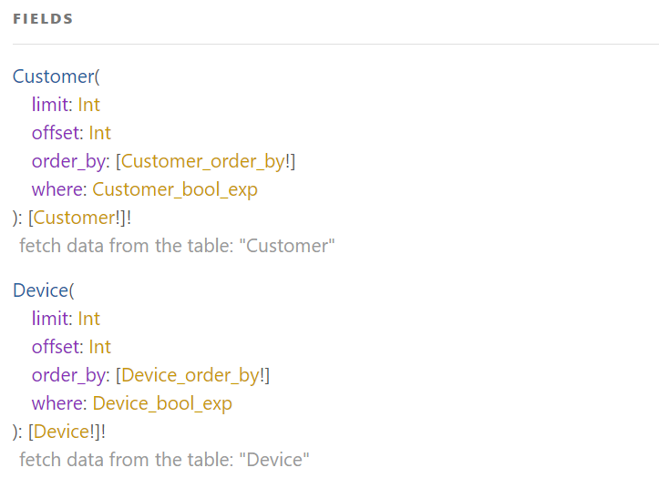
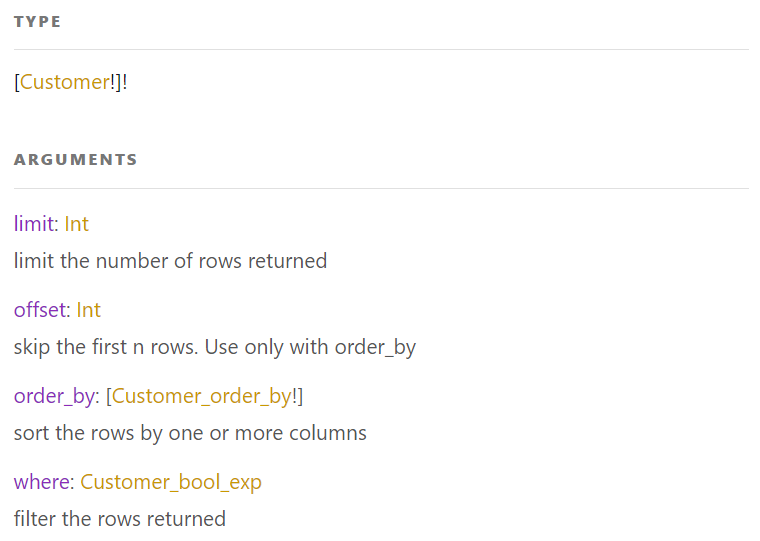
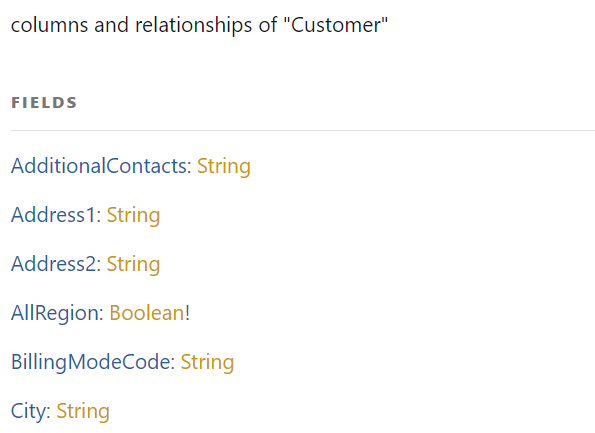
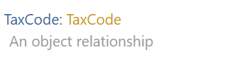
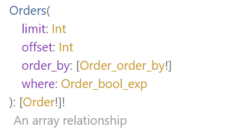

# :mag: GraphQL Schema

GraphQL provides a live schema via introspection of the API endpoint. That's a nerdy way of saying the available fields are always up to date and you don't have to worry about the documentation being stale!

## How to view the schema

There are a couple of easy ways to view the schema.

1) Head to the [Tooling](/tooling) page and follow the instructions listed there to view the schema docs via the Insomnia Client.
2) Use our [Data Queries](https://data.fast-weigh.dev) to view the schema in the browser based editor. Click on the "< Docs" button to expand the schema viewer panel on the query editor.




## Making sense of the schema

GraphQL queries are based on "Types". These types are similar to a SQL Table.

A "Customer" database table, for example, becomes a "Customer" type in GraphQL.

## Root type

First, you'll need to drill into a "root" type.

There are 2 available root types.
- query_root
- subscription_root

In the vast majority of cases, **query_root** is what you're after. It's equivalent to a SELECT query in SQL.

The **subscription_root** is useful for programmers wanting a live websocket connection to the data.



If you're following along, click into the "query_root" to continue.

## Exploring a GraphQL type

Inside the query_root you'll see a list of availble Types to explore.



Let's click into the Customer type.



Here, you'll see a link to view the fields available on the Customer type at the top.

You'll also see a list of arguments that can be passed into the type to filter or order the results returned.

For example the "limit" argument tells you that you can pass an integer to limit the number of results.

```gql
query GetOneHundredCustomers {
  Customer(limit: 100) {
    CustomerID
  }
}
```

Arguments/filters are covered further in our [GraphQL Crash Course](/graphql/crash-course).

Clicking inside the actual Customer type at the top reveals the fields available to you within that type.



## Object relationships

Object relationships on a type are 1:1 relationships with another type.

On the Customer type if you scroll to the bottom you'll see the "TaxCode" field. This is listed as an object type, meaning that if you query for the Customer's TaxCode the result will be a single TaxCode object.



## Array relationships

Array relationships on a type are 1:N relationships with another type.

On the Customer type you can find the "Orders" field. This is listed as an array type, meaning that querying for Orders will return a nested array of Orders for the Customer(s) you are filtering for.



## Go further

To learn more about querying types, passing arguments to filter data, and including fields via relationships, head to our [GraphQL Crash Course](/graphql/crash-course).
