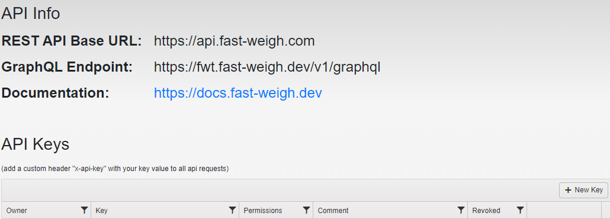

# :closed_lock_with_key: Authentication

This guide will walk you through setting up your API keys and getting your GraphQL endpoint URL.

!!!warning Basic Authentication has been deprecated
We have transitioned from using Basic Authentication with username/password credentials to token based authentication. Existing integrations will continue to work, but please note that Basic Auth has been deprecated and will be removed in the future.
!!!

## Create an API key and get endpoint 

On the Fast-Weigh Web Portal, go to the [API Info](https://portal.fast-weigh.com/APIInfo) page under the settings gear.



You should see the GraphQL Endpoint listed here as well as any available keys.

To create a new key click the "+ New Key" button on the grid and fill in the info required.

!!!warning Don't see API Info on your web portal?
1) You may not be an admin of your Fast-Weigh account. Check with a known admin to see if they can set up this key.
2) Your company's account may not have this enabled. If this is the case you will need to contact your sales or onboarding rep to get it enabled.
!!!

## Making requests

When making requests to the GraphQL or REST APIs include the following header:

```
x-api-key: your-key-goes-here
```

## Download tooling

See our [guide to API tooling](/tooling) for next steps and to test your credentials.