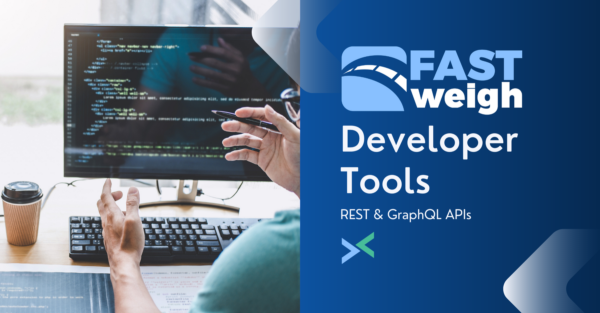

# :wave: Welcome / Overview

[Fast-Weigh](https://fast-weigh.com) is a modern cloud-based truck ticketing, ordering, and dispatching platform.

The Fast-Weigh REST & GraphQL APIs allows system integrators to interface with the Fast-Weigh data model to extend functionality and/or extract data for third party use.



## Authentication

The REST & GraphQL API services use token based authentication with a custom ```x-api-key``` HTTP header record. The token should be included with every call.

!!!warning Basic Authentication has been deprecated
We have transitioned from using Basic Authentication with username/password credentials to token based authentication. Existing integrations will continue to work, but please note that Basic Auth has been deprecated and will be removed in the future.
!!!

Learn more on the [authentication guide](/authentication)

## GraphQL

### Your endpoint

You can find your endpoint listed on the [API Info](https://portal.fast-weigh.com/APIInfo) page under the settings gear of the Fast-Weigh Web Portal.

If you cannot see the API Info page, API functionality has not been enabled for your company's account. You'll need to reach out to your Fast-Weigh onboarding or sales contact to get it enabled.

The endpoint should look something like:

!!!
```https://server-name.fast-weigh.dev/v1/graphql```
!!!

### API schema explorer

Your credentials will get you into our [GraphQL API Explorer tool](https://explorer.fast-weigh.dev). There, you can dive into the data model docs as well as test queries with the live editor.

## REST API

The REST API generally handles CREATE and UPDATE calls.

The OpenAPI/Swagger docs can be found here: [api.fast-weigh.com/swagger](https://api.fast-weigh.com/swagger)


