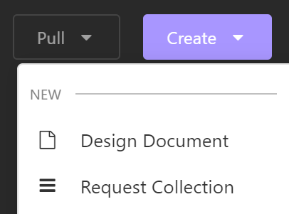
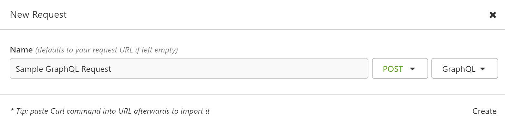
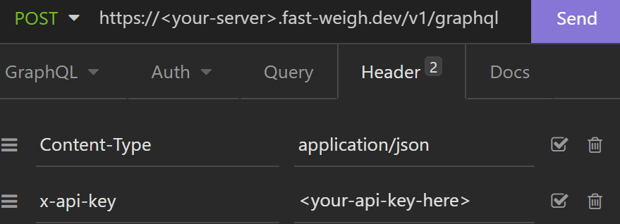
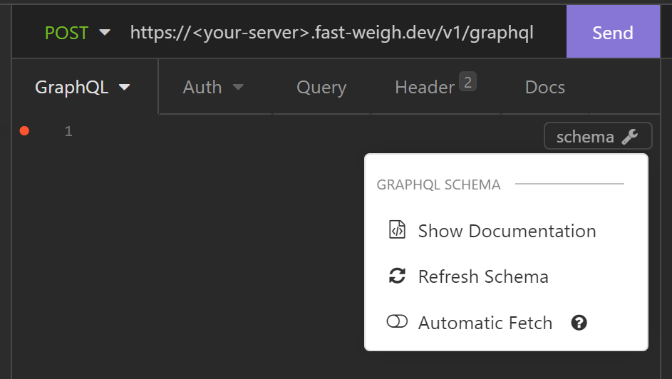
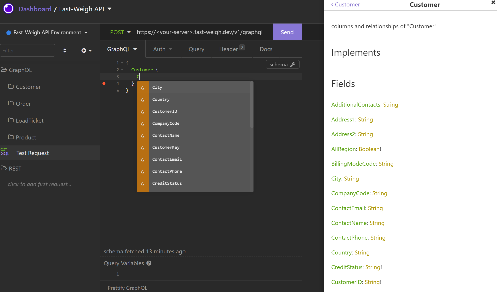

# :hammer_and_wrench: Tooling

This guide will walk you through setting up your development environment.

## Download tooling

We recommend using a tool called [Insomnia Client](https://insomnia.rest/products/insomnia) for query development and debugging. It has some great built-in features tailored for join REST and GraphQL development that make it quick and easy to get started.

[Grab the free download here](https://insomnia.rest/download)

## Setup development workspace

### Create a collection

Create a new request collection to house your queries.

### Create a request

In this Request Collection, you'll define your queries.

GraphQL Note: Make sure you remember to set the HTTP method to POST and the body to GraphQL Query.

### Add your endpoint and API key

In your request, fill in the URL/endpoint and go to the "Header" tab to paste your API key.

### (GraphQL Only) View documentation and enable autocompletion

Once your API key and endpoint are pasted in, you can view the always-up-to-date data model docs without leaving Insomnia.

Back on the "GraphQL" tab you should see a "schema" option at the top right of the query box.

Clicking on that will give you the option to refresh the schema. Doing so will fetch the latest data model from the server and build live documentation.

Once you have refreshed, you'll have access to the documentation as well as query autocompletion within the editor.

## Browser based editor

We've also built an online editor and schema explorer into our [Data Queries](https://data.fast-weigh.dev) platform. The editor features similar autocomplete options to the Insomnia Client.
